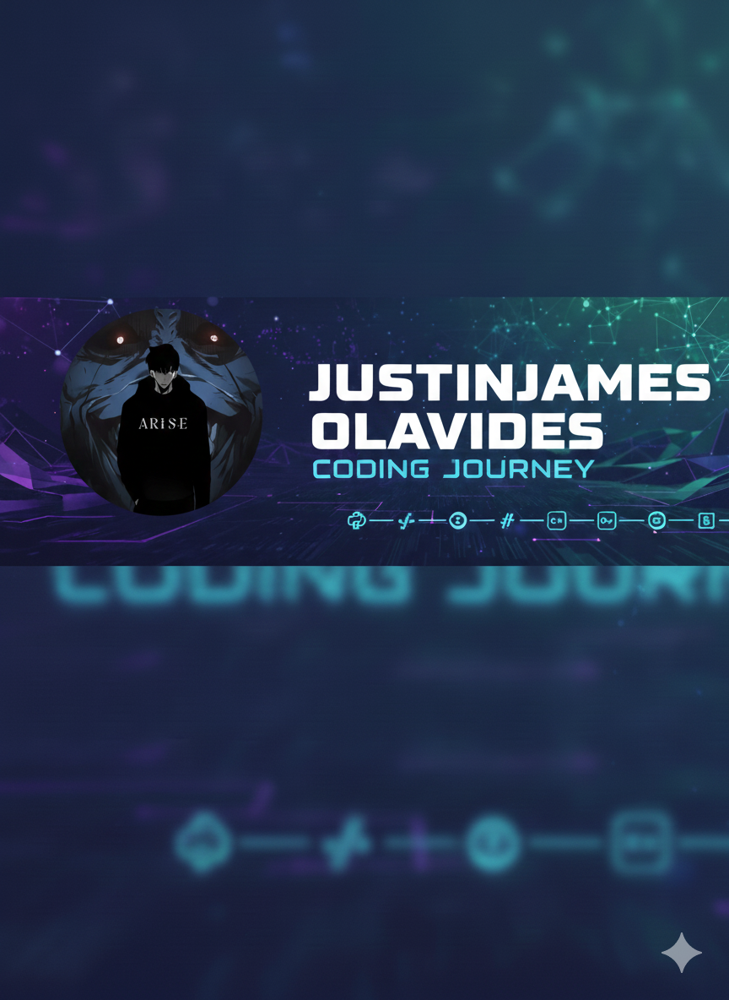

  

<h1 align="center">Hi there! 👋 I'm Justin James Olavides</h1>

Aspiring Full-Stack Web Developer | BSIT Student

---

### 💻 About Me

I'm an aspiring Full-Stack Web Developer currently pursuing a **Bachelor of Science in Information Technology**.  
I enjoy building responsive user interfaces and exploring server-side logic to build complete, production-ready applications.

📍 Based in the Philippines  
📫 Contact: justinolavides8@gmail.com

---

### 🛠 Currently Learning these Tech Stack

- **Front-End:** HTML, CSS, JavaScript, React
- **Back-End:** PHP (CodeIgniter / Laravel), Node.js
- **Database:** MySQL, MongoDB
- **Tools:** Git, GitHub, VS Code

---

### 🚀 What I’m Focusing On

- Building modern, responsive, and accessible front-end UI
- Learning scalable API design and database architecture
- Strengthening full-stack project skills with real-world apps

---

### 📌 Projects

### 📊 GitHub Stats

